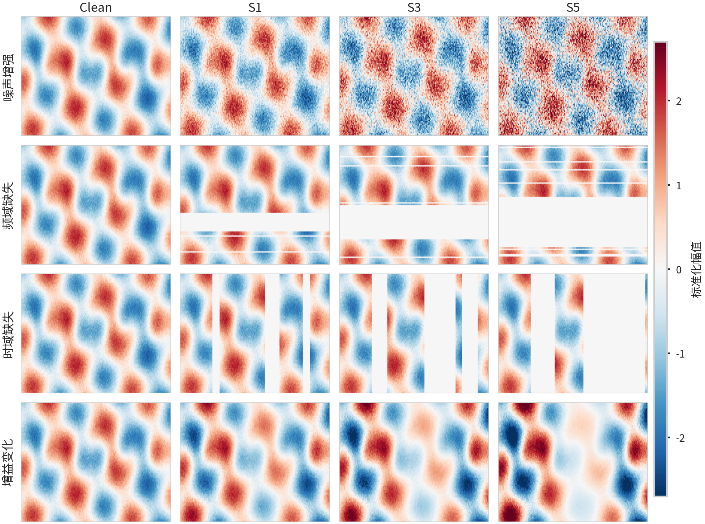

# WiFi CSI RobustBench

[](https://github.com/Shuran-z/Wifi-Csi-Robustbench/actions/workflows/ci.yml)


WiFi CSI RobustBench is a research benchmark for evaluating corruption robustness in WiFi Channel State Information (CSI) human-sensing models. It focuses on a practical question: whether a model that performs well on clean CSI samples remains reliable under wireless noise, missing subcarriers, temporal dropout, gain changes, and small natural domain shifts.

The lightweight release supports result review, statistical inspection, and figure regeneration. Full training reproduction requires external datasets and checkpoint archives.



The figure above shows representative CSI amplitude maps under clean input and increasing corruption severity. The benchmark uses this type of structured perturbation suite to make deployment risks easier to inspect and compare.

## Highlights

- Structured WiFi CSI corruption suite with seven perturbation types, five severities, and five corruption seeds.
- UT-HAR model-bank results covering 720 classical model configurations and 54 deep model runs.
- Final result tables with 774 clean model/run rows and 135,450 corruption-evaluation rows.
- Family-balanced mean performance under corruption (mPC), retention, and flat-seven sensitivity metrics.
- Validity-gated CSI-ER diagnostics for residual robustness after controlling for clean performance.
- Exploratory Widar minimum natural-shift check for synthetic-vs-natural shift alignment.
- Reproducible plotting scripts, source data, logs, reports, manifests, and checksums for the lightweight release.

## Quick Start

```bash
git clone https://github.com/Shuran-z/Wifi-Csi-Robustbench.git
cd Wifi-Csi-Robustbench

python3.12 -m venv .venv
source .venv/bin/activate
python -m pip install --upgrade pip
python -m pip install -r requirements-minimal.txt
python -m pip install -e .
```

Regenerate the benchmark figures from the included CSV files:

```bash
python scripts/plot_benchmark_figures.py --input . --output figures/final
```

Run the lightweight test suite:

```bash
pytest -q tests
```

## Repository Layout

```text
configs/          Benchmark, model-bank, and statistical protocol configs
docs/             Benchmark card, data card, model card, and reproducibility notes
figures/final/    Final figures plus source data for regeneration
logs/final/       Execution logs retained for traceability
manifests/final/  Checksums and checkpoint manifests
reports/final/    Statistical and natural-shift reports
results/final/    Final clean, corruption, robustness, and CSI-ER tables
scripts/          Data preparation, training, evaluation, analysis, and plotting scripts
src/              Python packages for metrics, corruptions, models, validity gates, and CLI helpers
tests/            Unit and smoke tests for the lightweight release
```

## Included Results

Main UT-HAR result tables:

- `results/final/combined-clean-metrics.csv`
- `results/final/combined-corruption-metrics-long.csv`
- `results/final/combined-robustness-summary.csv`
- `results/final/combined-validity-gated-csi-er-accuracy.csv`
- `results/final/combined-validity-gated-csi-er-macro-f1.csv`

Supplementary Widar natural-shift tables:

- `results/final/widar-minimum-bank-natural-shift.csv`
- `results/final/widar-minimum-bank-synthetic-corruptions-long.csv`

Final benchmark figures:

- `figures/final/benchmark-fig-01-overview.pdf`
- `figures/final/benchmark-fig-02-family-robustness-macro-f1.pdf`
- `figures/final/benchmark-fig-03-architecture-size-heatmap.pdf`
- `figures/final/benchmark-fig-04-corruption-family-retention.pdf`
- `figures/final/benchmark-fig-05-validity-gate-summary.pdf`
- `figures/final/benchmark-fig-06-widar-synthetic-natural-scatter.pdf`

Figure source data is stored in `figures/final/source-data/`.

## Metrics

`family-balanced mPC` is the primary robustness metric. It averages severity and seed results within each corruption, groups corruptions into deployment-risk families, and gives each family equal weight.

`retention` reports corrupted performance relative to the clean baseline. A retention value above 1 does not mean that the perturbation improves the model in a causal sense; it only means that the average corrupted score is slightly higher than the clean score for that setting.

`CSI-ER` is a residual diagnostic. It estimates whether a model is more or less robust than expected after accounting for clean performance. CSI-ER should be interpreted only when the validity gate reports `VALID`; `EXPLORATORY` and `OUT_OF_SUPPORT` rows are useful for diagnosis but should not be ranked as definitive winners.

## Reproducibility Levels

This repository supports three levels of reproduction:

1. Review final CSVs, reports, and figures without raw data or checkpoints.
2. Restore external checkpoints and run compatibility or selected inference checks.
3. Download official datasets and rerun training and evaluation from raw data.

See `docs/reproducibility.md` for details. The default installation instructions use `requirements-minimal.txt`; `requirements-lock.txt` records the original experiment environment and is mainly useful for external checkpoint compatibility.

## Weights and Data

Raw datasets, processed data caches, model checkpoints, and large compressed artifacts are not stored in Git. The final checkpoint set is approximately 12.7 GB and should be hosted separately through an artifact store such as GitHub Releases, Hugging Face Hub, Zenodo, or institutional storage.

Checkpoint manifests and checksums are retained under `manifests/final/`.

## Interpretation Guardrails

- Do not treat this release as a one-command full training reproduction package.
- Do not claim official NTU-Fi six-class performance from the Recovered5 engineering appendix.
- Do not claim CSI-ER is a universal theory of WiFi sensing robustness.
- Do not rank out-of-support CSI-ER values as official robustness winners.
- Treat the Widar minimum bank as exploratory natural-shift evidence, not as a complete multi-dataset benchmark.

## Citation

Use `CITATION.cff` for citation metadata. Before making benchmark claims, review `docs/benchmark-card.md`, `docs/data-card.md`, `docs/model-card.md`, and `docs/reproducibility.md`.

## License

This repository is released under the MIT License.
